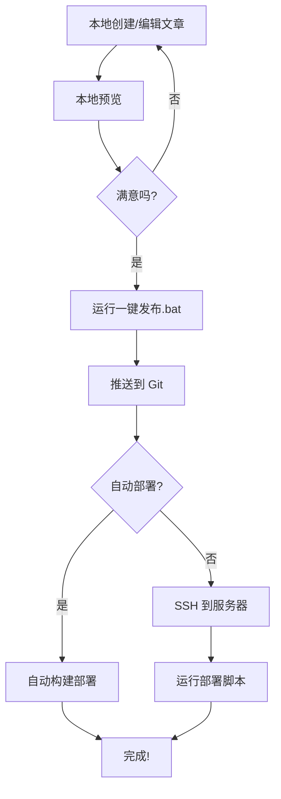
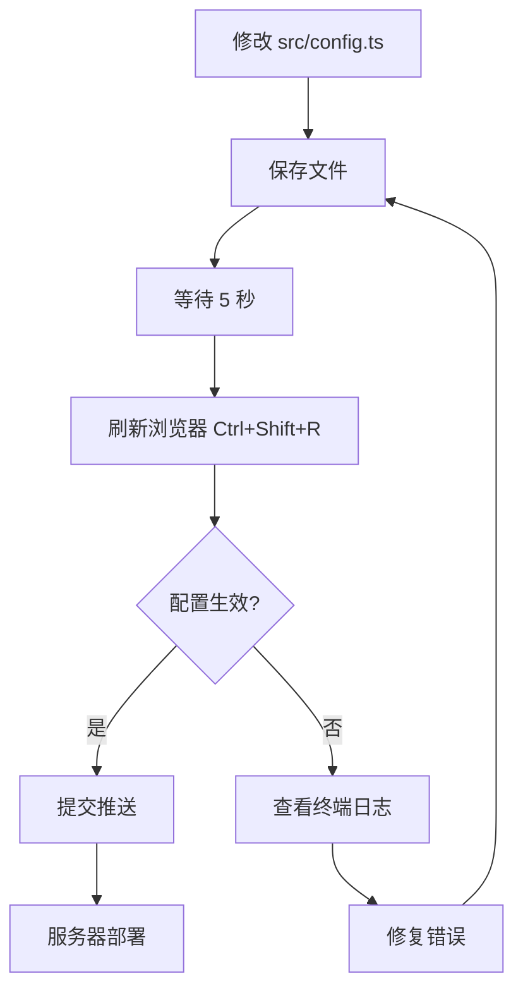

# 📚 博客部署和文章发布完整指南

## 🎯 当前状态

✅ **已完成的功能：**
1. ✅ 主页内容显示控制（博客/漫画/作品集）
2. ✅ 可视化配置页面（`/settings/`）
3. ✅ 本地一键发布脚本（`一键发布.bat`）
4. ✅ 服务器自动部署脚本（`服务器端-自动部署脚本.sh`）
5. ✅ 主页按时间排序显示所有内容

⚠️ **当前问题：**
- 作品集内容可能不显示在主页上

---

## 📋 目录

1. [本地开发和预览](#本地开发和预览)
2. [发布文章到服务器](#发布文章到服务器)
3. [主页内容控制](#主页内容控制)
4. [服务器部署流程](#服务器部署流程)
5. [常见问题解决](#常见问题解决)

---

## 🖥️ 本地开发和预览

### 启动开发服务器

```batch
cd "D:\cursor\project8  blog\Mizuki-master"
npm run dev
```

### 访问地址

- **本地：** http://localhost:4321/
- **局域网：** http://192.168.4.126:4321/
- **设置页面：** http://localhost:4321/settings/
- **手机访问：** http://192.168.4.126:4321/（确保在同一局域网）

---

## 📝 发布文章到服务器

### 方法1：使用一键发布脚本（推荐）

1. **双击运行** `一键发布.bat`
2. **输入提交信息**（例如：新增文章-小鹅通下载工具）
3. **等待推送完成**
4. **服务器自动更新**（如果配置了自动部署）

### 方法2：手动 Git 推送

```batch
# 1. 添加更改
git add .

# 2. 提交
git commit -m "新增文章：XXX"

# 3. 推送
git push
```

### 方法3：直接在服务器上修改（不推荐）

```bash
# SSH 连接服务器
ssh username@your-server-ip

# 进入项目目录
cd /path/to/your/blog

# 编辑文章
nano src/content/posts/my-article/index.md

# 重新构建
npm run build

# 部署
cp -r dist/* /var/www/html/blog/
```

---

## 🎛️ 主页内容控制

### 查看当前配置

**方法1：访问设置页面**
```
http://localhost:4321/settings/
```

**方法2：查看配置文件**
打开 `src/config.ts`，找到第 50-54 行：

```typescript
homepageContent: {
    showBlogPosts: true,      // ✅ 博客文章
    showMangaPosts: true,     // ✅ 漫画内容
    showPortfolioPosts: true, // ✅ 作品集
},
```

### 修改显示设置

**修改 `src/config.ts`：**

```typescript
// 只显示博客
homepageContent: {
    showBlogPosts: true,
    showMangaPosts: false,
    showPortfolioPosts: false,
},

// 显示所有内容
homepageContent: {
    showBlogPosts: true,
    showMangaPosts: true,
    showPortfolioPosts: true,
},
```

**保存后：**
1. 等待 5 秒（Astro 自动重新编译）
2. 刷新浏览器（Ctrl+Shift+R）

---

## 🚀 服务器部署流程

### A. 自动部署（推荐）

#### 配置 GitHub Actions

在项目中创建 `.github/workflows/deploy.yml`：

```yaml
name: Deploy to Server

on:
  push:
    branches: [ main ]

jobs:
  deploy:
    runs-on: ubuntu-latest
    steps:
      - uses: actions/checkout@v4
      - uses: actions/setup-node@v4
        with:
          node-version: '20'
      - run: npm install
      - run: npm run build
      - name: Deploy to Server
        uses: easingthemes/ssh-deploy@main
        env:
          SSH_PRIVATE_KEY: ${{ secrets.SSH_PRIVATE_KEY }}
          REMOTE_HOST: ${{ secrets.REMOTE_HOST }}
          REMOTE_USER: ${{ secrets.REMOTE_USER }}
          SOURCE: "dist/"
          TARGET: "/var/www/html/blog/"
```

**优点：**
- ✅ 推送代码后自动部署
- ✅ 无需手动操作
- ✅ 有完整的部署日志

#### 配置服务器 Git Hook

在服务器项目目录创建 `服务器端-自动部署脚本.sh`（我已为你准备好），然后：

```bash
# 上传脚本到服务器
scp 服务器端-自动部署脚本.sh username@server:/path/to/blog/

# SSH 到服务器
ssh username@server

# 赋予执行权限
chmod +x /path/to/blog/服务器端-自动部署脚本.sh

# 创建 Git Hook
cd /path/to/blog/.git/hooks
nano post-merge

# 写入以下内容：
#!/bin/bash
/path/to/blog/服务器端-自动部署脚本.sh

# 保存并赋予权限
chmod +x post-merge
```

现在每次 `git pull` 后会自动构建和部署！

### B. 手动部署

#### 在服务器上执行：

```bash
# 1. SSH 连接
ssh username@your-server-ip

# 2. 进入项目目录
cd /path/to/your/blog

# 3. 拉取最新代码
git pull origin main

# 4. 安装依赖（如果有更新）
npm install

# 5. 构建项目
npm run build

# 6. 备份当前版本（可选）
cp -r /var/www/html/blog /var/www/backup/blog-$(date +%Y%m%d-%H%M%S)

# 7. 部署到网站目录
rm -rf /var/www/html/blog/*
cp -r dist/* /var/www/html/blog/

# 8. 设置权限
chown -R www-data:www-data /var/www/html/blog
chmod -R 755 /var/www/html/blog
```

#### 或者使用准备好的脚本：

```bash
# 运行自动部署脚本
./服务器端-自动部署脚本.sh
```

---

## 📝 发布新文章流程

### 本地创建文章

#### 方法1：文件夹方式（推荐）

```batch
# 1. 进入 posts 目录
cd "src\content\posts"

# 2. 创建文章文件夹
mkdir "文章标题"
cd "文章标题"

# 3. 创建文章文件
echo --- > index.md
```

#### 方法2：单文件方式

```batch
# 直接在 posts 目录创建 .md 文件
cd "src\content\posts"
echo --- > 文章标题.md
```

### 编辑文章内容

```markdown
---
title: 文章标题
published: 2025-11-03
description: 文章描述
tags: ["标签1", "标签2"]
category: 分类名
image: ""
draft: false
---

# 文章标题

文章内容...
```

### 本地预览

```batch
npm run dev
```

访问：`http://localhost:4321/posts/文章标题/`

### 发布到服务器

双击运行 `一键发布.bat` 或手动执行：

```batch
git add .
git commit -m "新增文章：文章标题"
git push
```

---

## 🔧 常见问题解决

### Q1: 作品集不显示在主页？

**排查步骤：**

1. **检查配置开关**
```typescript
// src/config.ts
homepageContent: {
    showPortfolioPosts: true, // 确保是 true
},
```

2. **检查文件格式**
```bash
# 查看作品集文件列表
cd src/content/portfolio
ls -R
```

3. **检查文件 frontmatter**
```markdown
---
title: 标题
published: 2025-01-01   # 日期格式正确
description: 描述
tags: ["程序系"]
category: 作品集
draft: false            # 确保不是草稿
---
```

4. **查看终端日志**
```
检查是否有错误信息，例如：
InvalidContentEntryDataError
```

5. **清理缓存并重启**
```batch
cd "D:\cursor\project8  blog\Mizuki-master"
rmdir /s /q .astro
npm run dev
```

### Q2: 手机无法访问本地服务器？

**解决方法：**

1. **确认在同一局域网**
2. **检查 Windows 防火墙**
   - 打开"Windows Defender 防火墙"
   - 点击"允许应用通过防火墙"
   - 找到 Node.js，确保"专用"和"公用"都勾选
3. **使用正确的 IP 地址**
   ```batch
   ipconfig
   # 查找 "无线局域网适配器 WLAN" 下的 IPv4 地址
   ```
4. **确保配置了 host: true**
   ```javascript
   // astro.config.mjs
   export default defineConfig({
     server: {
       host: true,  // ✅ 允许外部访问
       port: 4321,
     },
   });
   ```

### Q3: 推送到 Git 失败？

**可能原因：**
- 网络问题
- 权限问题
- Git 配置问题

**解决方法：**
```batch
# 检查 Git 状态
git status

# 检查远程仓库
git remote -v

# 重新推送
git push -u origin main
```

### Q4: 服务器构建失败？

**排查步骤：**

1. **检查 Node.js 版本**
```bash
node --version  # 需要 18.0.0 或更高
```

2. **清理并重新安装依赖**
```bash
rm -rf node_modules package-lock.json
npm install
```

3. **清理 Astro 缓存**
```bash
rm -rf .astro
```

4. **查看构建日志**
```bash
npm run build
# 仔细查看错误信息
```

### Q5: 修改配置后不生效？

**解决步骤：**

1. **等待重新编译**（5-10 秒）
2. **强制刷新浏览器**（Ctrl+Shift+R）
3. **检查终端是否有错误**
4. **重启开发服务器**
```batch
# 停止服务器（Ctrl+C）
npm run dev
```

---

## 📂 项目文件结构

```
Mizuki-master/
├── src/
│   ├── config.ts                      # ✅ 主配置文件
│   ├── types/config.ts                # 类型定义
│   ├── content/
│   │   ├── posts/                     # 📝 博客文章
│   │   ├── manga/                     # 📚 漫画内容
│   │   ├── portfolio/                 # 💼 作品集
│   │   │   ├── programming/           #    程序系作品
│   │   │   └── normal/                #    正常系作品
│   │   └── config.ts                  # Content Collections 配置
│   ├── pages/
│   │   ├── index.astro                # 主页
│   │   ├── manga.astro                # 漫画页面
│   │   ├── portfolio.astro            # 作品集页面
│   │   ├── settings.astro             # ✅ 设置页面（新增）
│   │   └── portfolio/
│   │       ├── programming.astro      # 程序系页面
│   │       └── normal.astro           # 正常系页面
│   └── utils/
│       └── content-utils.ts           # 内容获取工具
├── 一键发布.bat                         # ✅ 本地一键发布（新增）
├── 服务器端-自动部署脚本.sh              # ✅ 服务器自动部署（新增）
├── 检查配置状态.bat                     # 检查配置状态
├── README-部署和发布.md                 # ✅ 本文档（新增）
├── 服务器部署后发布文章指南.md           # ✅ 详细指南（新增）
└── 主页内容显示控制说明.md              # ✅ 配置说明（新增）
```

---

## 🎯 推荐工作流程

### 日常写作发布流程



### 修改配置流程



---

## 📞 获取帮助

如果遇到问题：

1. **查看终端日志** - 大多数错误会在这里显示
2. **查看浏览器控制台** - F12 打开开发者工具
3. **查看配置文件** - 检查 `src/config.ts` 语法
4. **访问设置页面** - `http://localhost:4321/settings/`
5. **查看官方文档** - [Mizuki 文档](https://docs.mizuki.mysqil.com)

---

## 🎉 快速开始

**首次部署到服务器：**

1. 在服务器上克隆项目
```bash
git clone https://github.com/your-username/your-blog.git
cd your-blog
npm install
npm run build
```

2. 配置 Nginx/Apache 指向 `dist/` 目录

3. 设置自动部署（上传 `服务器端-自动部署脚本.sh`）

**日常发布文章：**

1. 本地创建文章
2. 双击 `一键发布.bat`
3. 输入提交信息
4. 完成！

---

**祝你使用愉快！ 🎊**

