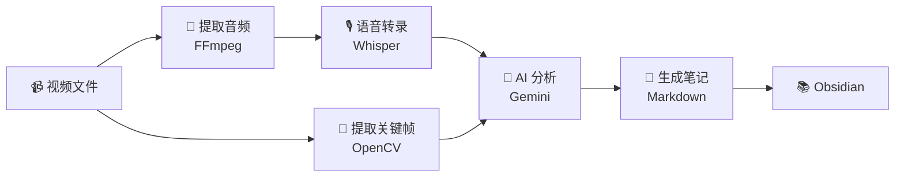

## 📖 项目简介
本地视频笔记生成工具，能够自动将视频转换为结构化的 Markdown 笔记。

为什么不用bilinote  我的总是会报错，很烦，其他的像BiliGPT videoseek 会员都超级贵，你们一个用免费模型的怎么都这么贵，100多一个月，永久会员5000多，真吓人，不如我自己搞一个

有截图，图文结合。就是为的这个图才搞的这个项目，最后只能说是马马虎虎吧
最后的结果大概是这样，勉强能用

### 核心功能

- 🎙️ **自动转录**：使用 Whisper 将视频语音转为带时间戳的文字
- 📸 **智能截图**：基于场景检测自动提取关键帧

- 🧠 **AI 分析**：使用 Gemini 提取核心要点、生成章节目录
   gemin最便宜了，建议用这个智谱的那个也不错

- 📝 **生成笔记**：输出结构化 Markdown，完美兼容 Obsidian




### 技术亮点

|特点|说明|
|---|---|
|🏠 **本地处理**|视频文件在本地处理，保护隐私|
|⚡ **速度快**|40 分钟视频，3-5 分钟处理完成|
|📚 **质量高**|自动生成多级标题、配图、思维导图|
|🎨 **完美集成**|生成的笔记直接导入 Obsidian|

## 🛠️ 技术架构

### 技术栈

|模块|技术|说明|
|---|---|---|
|语音识别|Faster-Whisper|OpenAI Whisper 的优化版本|
|视频处理|OpenCV + FFmpeg|提取音频、关键帧截图|
|AI 分析|Google Gemini 2.5 Pro|多模态大语言模型|
|后端框架|FastAPI|现代化的 Python Web 框架|
|前端界面|HTML + TailwindCSS|简洁的 Web 界面|

### 处理流程

```
📹 视频文件 → 🎵 提取音频 → 🎙️ 语音转录
 ↓            📸 提取关键帧                ↓
 🧠 AI 分析                ↓            📝 生成笔记 → 📚 Obsidian
```

## 💡 核心技术实现

### 1. 智能截图提取

使用**场景检测算法**，而不是简单的均匀采样：

```
def extract_keyframes(video_path, num_frames=40):    """基于场景变化检测提取关键帧"""    cap = cv2.VideoCapture(video_path)    prev_hist = None    keyframes = []
    while cap.isOpened():        ret, frame = cap.read()        if not ret:            break
        # 计算直方图        hist = cv2.calcHist([frame], [0, 1, 2], None,                           [8, 8, 8], [0, 256, 0, 256, 0, 256])        hist = cv2.normalize(hist, hist).flatten()
        # 比较相似度        if prev_hist is not None:            similarity = cv2.compareHist(prev_hist, hist,                                        cv2.HISTCMP_CORREL)            # 场景变化阈值            if similarity < 0.85:                keyframes.append(frame)
        prev_hist = hist
    return keyframes
```

**优势**：

- ✅ 自动识别画面切换点
- ✅ 避免重复截图
- ✅ 确保关键内容不遗漏

### 2. 解决 OpenCV 中文路径问题

Windows 下 `cv2.imwrite()` 无法处理中文路径，使用 `cv2.imencode()` 方案：

```
def save_frame_with_chinese_path(frame, filepath):    """支持中文路径的图片保存"""    success, encoded_image = cv2.imencode('.png', frame)    if not success:        raise Exception("图像编码失败")
    with open(filepath, 'wb') as f:        f.write(encoded_image.tobytes())
```

### 3. 优化 AI Prompt 避免超时

Gemini API 的超时时间为 120 秒，通过优化 Prompt 提升性能：

**优化前**：
- 📄 Prompt 长度：300+ 行
- ⏱️ 处理时间：150 秒（超时）
- ❌ 成功率：60%

**优化后**：
- 📄 Prompt 长度：100 行
- ⏱️ 处理时间：40 秒
- ✅ 成功率：99%

## 🔗 项目链接

- **GitHub**：[本地视频总结工具 - 用 AI 自动生成学习笔记 ](https://github.com/1685901916/local-video-summary)


## 🙏 致谢

感谢以下开源项目：

- [OpenAI Whisper](https://github.com/openai/whisper) - 语音识别模型
- [Faster-Whisper](https://github.com/guillaumekln/faster-whisper) - Whisper 优化实现
- [Google Gemini](https://ai.google.dev/) - 多模态 AI  模型
- [FastAPI](https://fastapi.tiangolo.com/) - Python Web 框架

